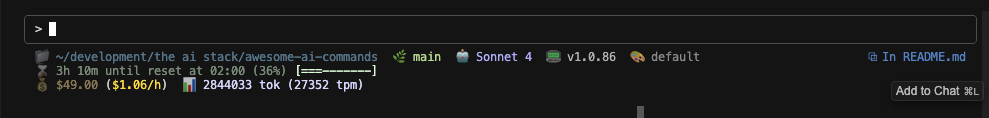

# Claude Code Statusline

A custom statusline script for Claude Code that provides comprehensive information about your development environment, session status, and usage metrics.



## Features

The statusline displays:

- **📁 Current Directory** - Shows working directory with home shortening (`~`)
- **🌿 Git Branch** - Current git branch or commit hash
- **🤖 Model Information** - Claude model name and version
- **📟 Claude Code Version** - Current Claude Code version
- **🎨 Output Style** - Active output style configuration
- **🧠 Context Usage** - Remaining context window with visual progress bar
- **⌛ Session Time** - Time until usage limit reset with progress indicator
- **💰 Cost Tracking** - Current session cost and burn rate
- **📊 Token Usage** - Total tokens used and tokens per minute

## Requirements

### System Dependencies

- **jq** - JSON command-line processor
  ```bash
  # macOS
  brew install jq
  
  # Ubuntu/Debian
  sudo apt install jq
  
  # Fedora/RHEL
  sudo dnf install jq
  ```

- **ccusage** - Claude Code usage analyzer (optional, for cost/usage metrics)
  ```bash
  npm install -g ccusage
  ```

### Shell Environment

- Bash shell (tested on macOS and Linux)
- Git (for branch detection)
- Standard Unix utilities: `date`, `tail`, `head`

## Installation

1. Ensure the script is executable:
   ```bash
   chmod +x .claude/statusline.sh
   ```

2. The script should be automatically detected by Claude Code when placed in the `.claude/` directory

## Configuration

The statusline automatically detects:

- **Git repositories** - Shows branch/commit info when in a git repo
- **Session files** - Reads from `~/.claude/projects/` for context usage
- **ccusage data** - Integrates with ccusage for cost/usage metrics

## Troubleshooting

### "Context Remaining: TBD"
- Session data not available yet
- First message in a new session
- Session file doesn't exist

### Missing Git Branch
- Not in a git repository
- Git not installed or not in PATH

### No Cost/Usage Data
- ccusage not installed
- No active usage blocks
- Network issues accessing usage data


To modify colors or add features, edit the relevant sections in `statusline.sh`.